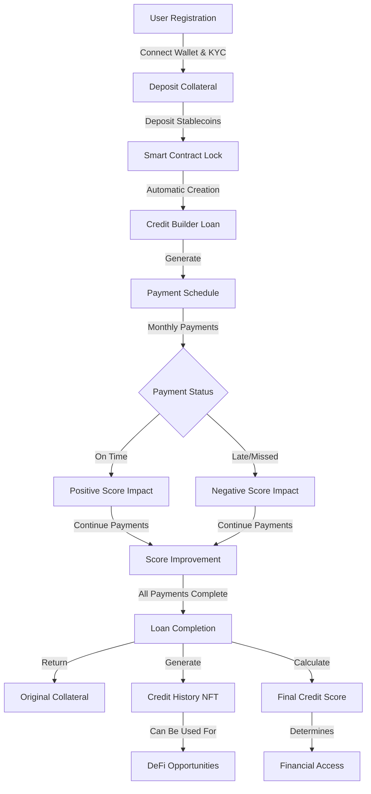

# Product Requirements Document: Onchain Credit Score Builder Loans

## Executive Summary

### Product Vision
An innovative decentralized platform that helps individuals build verifiable credit histories on the blockchain through structured credit builder loans, creating financial inclusion for the underbanked while generating sustainable revenue through various service fees and marketplace opportunities.

### Problem Statement
Over 1.7 billion adults worldwide lack access to financial services due to missing credit histories. Traditional credit scoring systems are opaque, centralized, and inaccessible to many.  
This creates a paradoxical barrier: without credit history, individuals cannot access loans; without loans, they cannot build credit history.

### Solution Overview
Our platform solves this problem by creating a transparent, blockchain-based credit building system where users can establish verifiable financial reputations through a structured process:

- Deposit collateral into a smart contract
- Make regular payments over time
- Build a transparent credit history
- Access progressively better financial opportunities

---

## User Journey & Core Process

### 1. User Registration
- Connect blockchain wallet
- Complete basic KYC verification (adjustable based on regulatory requirements)
- Review and accept platform terms

### 2. Credit Builder Loan Process

#### Step 1: Collateral Deposit
- User deposits a specific amount (e.g., $100 in stablecoins) into a smart contract.
- Collateral is locked for the duration of the credit building period.
- Deposit amount determines the loan amount (typically 1:1 ratio).

#### Step 2: Loan Creation
- Smart contract automatically creates a "credit builder loan" equal to the collateral amount.
- Example: $100 loan at 8% APR over 12 months.
- Monthly payment: approximately **$8.67**.
- Payment schedule is established and visible to the user.

#### Step 3: Payment Process
- User makes monthly payments of $8.67 for 12 months (total: ~$104).
- Each payment includes principal repayment plus interest.
- Payments are made directly from the user's wallet to the smart contract.
- Payments recorded on-chain as verifiable transactions.
- On-time payments positively impact the user's credit score.
- Late/missed payments negatively impact the credit score and may incur penalties.

#### Step 4: Loan Completion
- After all payments, the smart contract returns the original $100 collateral.
- Platform retains the interest (~$4) as revenue.
- User receives:
  - Final credit score
  - Completed loan certificate (NFT)

---

## Financial Flow Example

| Month | Payment Amount | Principal | Interest | Remaining Balance |
|:-----:|:--------------:|:---------:|:--------:|:-----------------:|
| Start | - | - | - | $100.00 |
| 1 | $8.67 | $7.67 | $1.00 | $92.33 |
| 2 | $8.67 | $7.75 | $0.92 | $84.58 |
| 3 | $8.67 | $7.82 | $0.85 | $76.76 |
| 4 | $8.67 | $7.90 | $0.77 | $68.86 |
| 5 | $8.67 | $7.98 | $0.69 | $60.88 |
| 6 | $8.67 | $8.06 | $0.61 | $52.82 |
| 7 | $8.67 | $8.14 | $0.53 | $44.68 |
| 8 | $8.67 | $8.22 | $0.45 | $36.46 |
| 9 | $8.67 | $8.30 | $0.37 | $28.16 |
| 10 | $8.67 | $8.38 | $0.28 | $19.78 |
| 11 | $8.67 | $8.47 | $0.20 | $11.31 |
| 12 | $8.67 | $11.31 | $0.11 | $0.00 |

- **Total**: 
  - Payments: **$104.04**
  - Principal: **$100.00**
  - Interest: **$4.04**

> Note: At the end, the user receives their $100 deposit back. The platform keeps $4.04 as revenue.

---

## Credit Score System

### 1. Credit Score Calculation

| Factor | Weight | Description |
|:------:|:------:|:-----------:|
| Payment History | 60% | On-time vs. late/missed payments |
| Loan Duration | 15% | Length of credit history |
| Payment Consistency | 15% | Pattern of regular payments |
| Loan Amount | 10% | Size of loans managed successfully |

### 2. Credit Score Scale
- **300-549**: High Risk
- **550-649**: Medium Risk
- **650-749**: Low Risk
- **750-850**: Minimal Risk

### 3. Score Updates
- Real-time updates after each payment
- Current score and payment history displayed on dashboard
- Explanations for score changes
- Visual trends over time

### 4. Credit History NFT
Each completed loan generates a **Credit History NFT** that:
- Contains verifiable payment history
- Displays final credit score
- Is portable across DeFi platforms
- Can be selectively shared
- Is non-transferable (soulbound token)

---

## User Interface Requirements

### 1. Dashboard
- Current credit score with historical trend
- Active loan details:
  - Original deposit
  - Monthly payment
  - Next payment due date
  - Remaining payments
  - Projected completion date
- Payment history visualization
- Financial opportunities based on credit score

### 2. Payment Interface
- Manual one-time payment
- Scheduled automatic payments
- Partial payment handling
- Payment receipts
- Upcoming payment reminders
- Late payment alerts

### 3. Credit Profile
- Detailed credit score breakdown
- Explanations by factor
- Recommendations for improvement
- Credit History NFT gallery
- Selective sharing controls

### 4. Marketplace
- Loan offerings based on credit score
- Financial service provider listings
- Loan comparison tools
- New service application interface
- Success rates

---

## Revenue Model

### 1. Interest Revenue
- **Description**: Interest charged on loans
- **Example**: $100 loan at 8% APR → ~$4 interest
- **Collection Method**: Automatically deducted
- **Scaling**: Directly with volume and loan size

### 2. Service Fees
- **Origination Fee**: 1-2% of loan
- **Monthly Service Fee**: $1 per active loan
- **Early Withdrawal Fee**: 5% of collateral

### 3. Premium Features
- Advanced Analytics: **$5/month**
- Expedited Credit Building: **$10/month**
- Credit Score Certification: **$15 per certificate**
- Custom Loan Terms: **$5 setup fee**

### 4. Marketplace Revenue
- **Referral Fees**: 1-3% commission
- **Listing Fees**: 
  - Basic listing: **$500/month**
  - Featured placement: **$2,000/month**
- **Matching Fees**: 0.5-1% per matched loan

### 5. Revenue Example Scenarios

**Small Scale Example:**
- 1,000 users with $100 loans
- Total Annual Revenue: **$22,500**

**Medium Scale Example:**
- 100,000 users with $250 loans
- Total Annual Revenue: **$7,000,000**

---

## Technical Architecture

### 1. Smart Contract System
- **Solidity-based** on Ethereum/EVM chains
- Core contracts:
  - `CredVerify.sol`: Manage all processes
  - `ReputationNFT.sol`: Issues NFTs

### 2. Data Layer
- **On-chain**:
  - Loan terms
  - Payment history
  - Credit scores
  - NFT metadata
- **Off-chain**:
  - User profiles
  - UI preferences
  - Analytics data
  - Growth rate metrics

---

## Future Features
- Real-world credit utilization bridges
- Multi-collateral options (including yield-bearing assets)
- Insurance products for loan protection
- DAO governance for community parameters
- Expanded financial education ecosystem

## User Journey Flow

